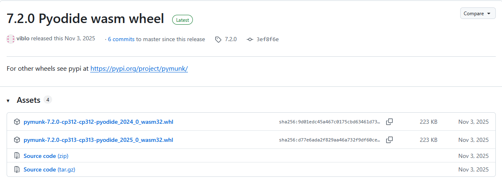

# Pyxel_Web_Test
## 概要
Web版Pyxel公式では、Pyodideで公式対応**している**モジュールの導入方法の説明があります。

https://github.com/kitao/pyxel/blob/main/docs/pyxel-web-ja.md

そこで、Pyodideで公式対応**していない**モジュールを**簡単に**導入する方法について調べました。

## PymunkをWeb版Pyxelで動かす
Pyxel × Pymunkで物理シミュレーションを始めよう！

https://qiita.com/malo21st/items/32b7865e7c78d4ac2741

「Pyxel × Pymunkで物理シミュレーションを始めよう！」を Webで動かしたい🌎

https://qiita.com/Kazuhito/items/cf7f2e0f42f47e611f3e

こちらの記事でWeb版のPyxelでPymunkを動かせるようにPymunk公式さんに対応していただいたようで、素晴らしいですね！

ただ、PyxelでPymunkモジュールをロードするのに大変なことをされていたので、もっと簡単に動かせないか試したら出来ました。

動作確認URL：
https://gomatama5.github.io/Pyxel_Web_Test/shot_bullet.html

最初の記事の.pyファイルをそのままWeb版のPyxelで動かせます！

### やり方
Web版のhtmlで
```html
<pyxel-run name="shot_bullet.py"></pyxel-run>
```
を
```html
<pyxel-run name="shot_bullet.py" packages="cffi,pymunk-7.2.0-cp313-cp313-pyodide_2025_0_wasm32.whl"></pyxel-run>
```
というようにpackageの記述を追加するだけでOKです。

尚、PymunkのPyodide対応WASM Wheelは上記記事でも紹介されていますが、Pymunk公式GitHubのReleaseページにあります。

https://github.com/viblo/pymunk

### 補足
packageにPymunkのWASM Wheelファイルを指定しただけでは動かず、その前提となるcffiモジュールが必要だったので、その記述も追加したら動きました。
cffiモジュールはPyodide公式対応しているのでpackageにcffiと書くだけでOKでした。

## PymunkのWASM Wheelのバージョンについて（2026/2/8追記）
PymunkのWASM Wheelは対応するPythonのバージョンごとに複数のファイルがリリースされています。



どのバージョンのWASM Wheelを使えば良いでしょうか？

それを調べるには、Web版のPyxelが動いているPythonバージョンを知る必要があります。
Web版のPyxelは、pyxel.jsの中で指定されたバージョンのPyodideを動かしています。
Pyodideは、対応したバージョンのPythonをブラウザ上で動かしています。

記事執筆時点の直近のバージョンの対応は次のようになっていました。

| Pyxelバージョン             | Pyodideバージョン | Pythonバージョン |
| --------------------------- | ----------------- | ---------------- |
| 2.5.0～2.5.8                | v0.27.7           | 3.12             |
| 2.5.9～2.5.13、2.6.0～2.6.4 | v0.28.3～v0.29.3  | 3.13             |

### Web版Pyxelバージョンチェッカー

今後もバージョンアップがあるでしょうし、この対応をいちいち確認するのは面倒なので、確認するためのスクリプトを作成しました

[web_pyxel_version_check.py](web_pyxel_version_check.py)

使い方はWeb版Pyxelを実行するHTMLファイルを引数に指定して実行するたけです。今回の例なら次のようになります。

```
python web_pyxel_version_check.py shot_bullet.html
```

実行すると```shot_bullet_version_check.html```のように名前に```_version_check```が付いたHTMLファイルが生成されるので、それをブラウザで開くとPyodideを実行してPythonのバージョンを出力してくれます。

```
Pyxel: https://cdn.jsdelivr.net/gh/kitao/pyxel@2.6.4/wasm/pyxel.js
Pyodide: https://cdn.jsdelivr.net/pyodide/v0.29.3/full/pyodide.js
Python: 3.13.2
```

この例の場合では、Pythonのバージョンが```3.13```なので、```cp313```と書かれた次のWASM Wheelを使えば良いことが分かります。

```
pymunk-7.2.0-cp313-cp313-pyodide_2025_0_wasm32.whl
```

PymunkのようにPythonのバージョンごとにWASM Wheelが分けられている場合は、Pyxelのバージョンアップで動かすPythonのバージョンが変わってWheelが動かなくならないよう、Pyxelのバージョンを固定しておくのが良いでしょう。

例えば、次のように書きます（```@2.6.4```の部分を利用したいPyxelのバージョン番号に書き換えましょう）。

```html
<script src="https://cdn.jsdelivr.net/gh/kitao/pyxel@2.6.4/wasm/pyxel.js"></script>
```

# typehandlerをWeb版Pyxelで動かす
【typehandler】最短9行で実装！タイピングゲーム用のPythonモジュールを作ってみた

https://qiita.com/Prosamo/items/23e9a64c6199e035abf1

【40行で実装】Pyxelでタイピングゲームを作りたい！

https://qiita.com/Prosamo/items/3717b34e2ed110ebd8e5

こちらの記事でタイピングゲーム用のPythonモジュールを紹介されています。
これをWeb版のPyxelで動かしてみました。

動作確認URL：
https://gomatama5.github.io/Pyxel_Web_Test/simple_typing.html

### やり方
タイピングゲーム用のPythonモジュールのtypehandlerはPure Pythonで書かれているそうで、Wheelを指定するだけで動きました。
```html
<pyxel-run name="simple_typing.py" packages="typehandler-0.5.1-py3-none-any.whl"></pyxel-run>
```

Wheelは、作者様が公開されているGitHubページのdistフォルダ以下からダウンロードするかpip downloadすればOKです。

https://github.com/Prosamo/typehandler/

### 補足
動作確認用コードは必要最小限に絞りました。
日本語を表示するとかもっとちゃんと作る場合は、上記の記事で作者様がサンプルを公開されているので、それを見ると良いでしょう。

## 変更履歴
- 2026/2/8: PymunkのWASM Wheelのバージョンの選び方やWeb版Pyxelが動いているPythonバージョンの確認方法を追記しました。ついでにPymunkのWheelを最新版に差し替えました。